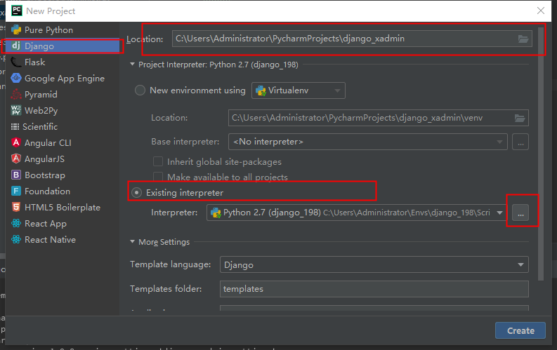
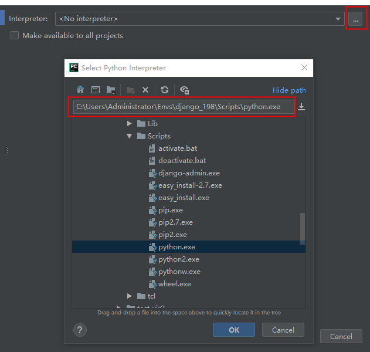
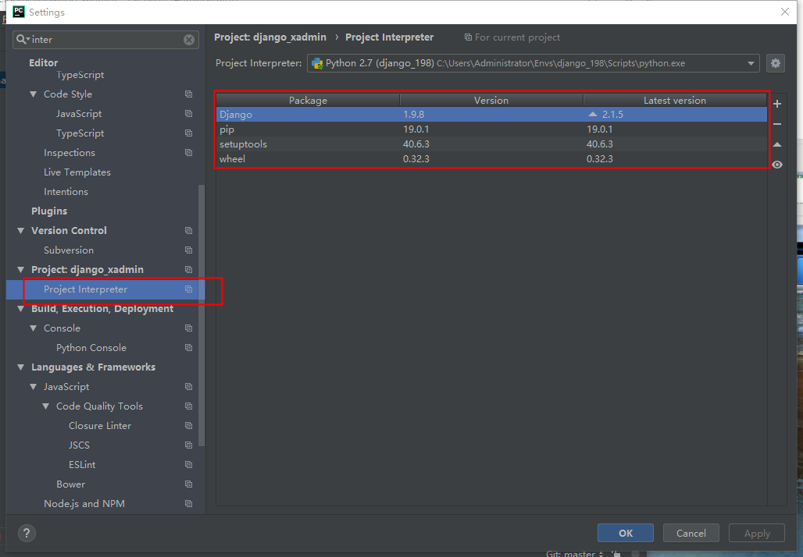
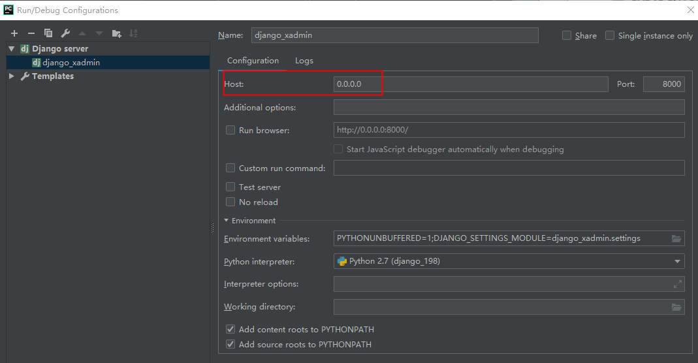
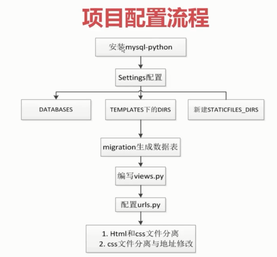

# Django

## windows下 python 2.7 virtualenv 虚拟环境的搭建

### virtualenv

- 不同引用开发环境独立
- 环境升级不影响其他应用，不不会影响全局的python环境
- 防止系统中出现包管理混乱和版本的冲突

``` cmd

pip2 -V 或 pip3 -V
Fatal error in launcher: Unable to create process using '"'

解决方案
python2 -m pip install --upgrade pip
python3 -m pip install --upgrade pip
```

``` cmd
pip2 install virtualenv
virtualenv test_vir

testvir安装在当前指向命令的目录下

进入test_vir/Scripts目录下执行 activate.bat 进入 test_vir 虚拟环境

查看当前虚拟环境安装的包
(test_vir) pip list

退出当前虚拟环境
(test_vir) deactivate

```

### virtualenvwrapper-win

> Windows OS 使用 virtualenvwrapper-win, Like Unix OS 使用 virtualenvwrapper

``` cm
pip2 install virtualenvwrapper-win

创建虚拟环境并自动进入虚拟环境: mkvirtualenv test_vir2
创建虚拟环境目录如下：C:\Users\Administrator\Envs\
退出虚拟环境：deactivate
查看虚拟环境：workon
进入已存在的虚拟环境：workon test_vir2
查看虚拟环境下的包列表信息：pip2 list
安装requests包：pip2 install requests
卸载requests包：pip2 uninstall requests
```

### 项目环境搭建

1. 在虚拟环境下下载djngo-1.9.7版本

```cmd
mkvirtualenv django_198
(django_198) pip install django==1.9.8
```

2. pycharam创建虚拟环境





3. 在pycharm查看虚拟环境



4. 运行django项目
  + 菜单"Run" ->  Run -> django_admin
  + 底部显示运行状态信息 http://127.0.0.1:8000/ 

5. 修改IP地址



6. 设置目录标记
  + templates目录设置为Template Folder
  + django_xadmin目录设置为 Sources Root

### 新建数据库

- django_xadmin
  - 排序规则：utf8mb4_general_ci
  - 字符集：utf8mb4 -- UTF-8 Unicode

### django目录结构

- django_admin
  - settings.py 全局配置
  - urls.py url入口
  - wsgi.py 服务配置文件
- templates 放置html文件
- manage.py 启动django文件
  - django的命令

### 创建应用 app

1. Tools -> Run manage.py Task ... 或 Ctrl+Alt+R
2. manage.py@django_xadmin > startapp message
3. 创建静态文件目录 static
4. 创建日志目录 log
5. 创建上传目录 media
6. 创建统一管理app的目录 apps, 并把 message应用拖入到apps目录下; apps目录下自动生成 `__ini__.py` 文件，其apps目录可以成为可导入的包
7. manage.py 文件里引入message应用的views

``` py
from apps.message import views
```

简写方法:

1. `apps` 标记为 `Sources Root`
2. `manage.py` 文件修改 `from message import veiws`
3. 在pycharm 自动识别apps目录下的各个应用（apps作为全局搜索路径），但是在命令行下找不到message

``` cmd
1. 复制项目目录：copy path
2. cmd
3. workon django_198
4. cd C:\Users\Administrator\PycharmProjects\django_xadmin
5. python manage.py runserver


(django_198) C:\Users\Administrator\PycharmProjects\django_xadmin>python manage.py runserver
Traceback (most recent call last):
  File "manage.py", line 5, in <module>
    from message import views
ImportError: No module named message
```

因为cmd中通过setting.py 查找模块路径，但没有apps作为根路径查找

---

**配置MySQL***

`setting.py`

``` py
DATABASES = {
    'default': {
        'ENGINE': 'django.db.backends.mysql',
        'NAME': 'django_xadmin',
        'USER': 'root',
        'PASSWORD': '123456',
        'HOST': '192.168.1.2'
    }
}
```

---

问题：django.core.exceptions.ImproperlyConfigured: Error loading MySQLdb module: No module named MySQLdb

安装mysql驱动

``` cmd
> workon django_198
> pip install mysql-python

报错：building '_mysql' extension
error: Microsoft Visual C++ 9.0 is required. Get it from http://aka.ms/vcpython27

但错误提示里也谢了缺少C++的相关环境，后来在网上找到方法了：
方法如下：

1.在http://www.lfd.uci.edu/~gohlke/pythonlibs/#mysql-python下载对应的包版本，如果是win7 64位2.7版本的python，就下载

[MySQL_python-1.2.5-cp27-none-win_amd64.whl](https://download.lfd.uci.edu/pythonlibs/r5uhg2lo/MySQL_python-1.2.5-cp27-none-win_amd64.whl)

当然需要在cmd下跳转到下载MySQL_python-1.2.5-cp27-none-win_amd64.whl的目录下
然后在命令行执行
(django_198)  C:\Users\Administrator\PycharmProjects\django_xadmin>cd C:\Users\Administrator\Downloads

(django_198) C:\Users\Administrator\Downloads>pip install MySQL_python-1.2.5-cp27-none-win_amd64.whl

然后就安装成功了MySQL-python


错误：Error fetching command 'collectstatic': You're using the staticfiles app without having set the STAT
解决：settings.py 最后一行添加
STATIC_ROOT = os.path.join(BASE_DIR, 'static')
```

运行默认的数据表
``` cmd
manage.py@django_xadmin > makemigrations 数据变更
manage.py@django_xadmin > migrate 生成数据表

navigate 查看数据表是否生成
```

form.html 页面呈现出来

settings.py

``` py
TEMPLATES = [
    {
        'BACKEND': 'django.template.backends.django.DjangoTemplates',
        'DIRS': [os.path.join(BASE_DIR, 'templates')]


django框架设置static目录配置
STATICFILES_DIRS = [
    os.path.join(BASE_DIR, 'static')
]

```



### models.py

### urls.py

### views.py

### django templates 配置